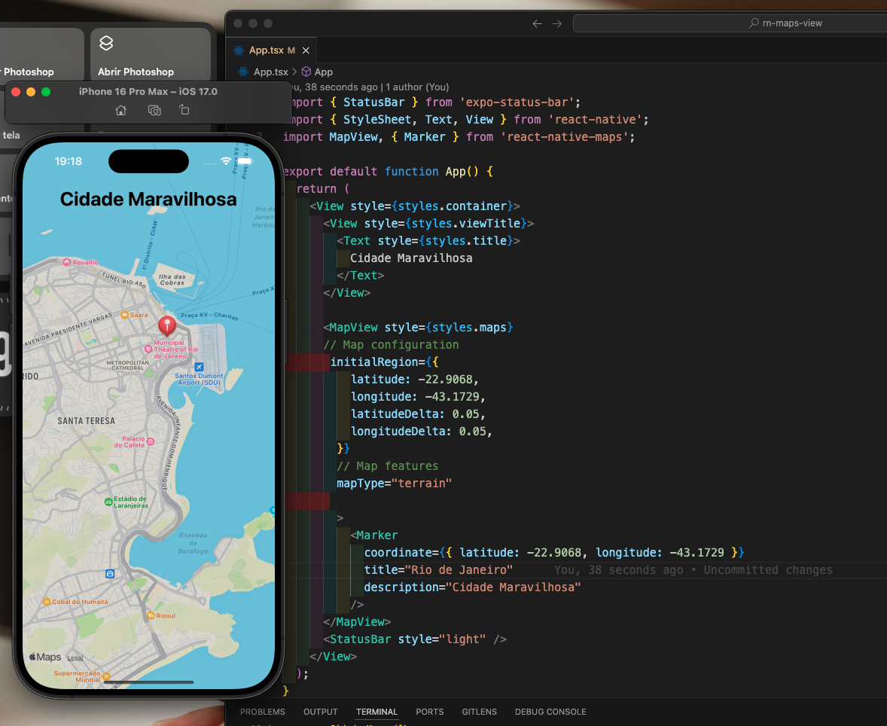

# React Maps View
If you want to add maps to your app quickly and efficiently, the combo React Native + Expo + Maps is one of the most practical solutions in the mobile ecosystem.

With just a few commands, you can render interactive maps, add markers, customize styles, and integrate geolocation features. And the best part: it works on both Android and iOS using the same codebase.

## react-native-maps
A library that provides a Map component that uses Google Maps on Android and Apple Maps or Google Maps on iOS.

## Clone or Copy
```
git clone 
https://github.com/jorgeacruz/rn-maps-view.git
```
## Installation

```
npx expo install react-native-maps
```
## Add some code 
```
import React from 'react';
import MapView from 'react-native-maps';
import { StyleSheet, View } from 'react-native';

export default function App() {
  return (
    <View style={styles.container}>
      <MapView style={styles.map} />
    </View>
  );
}

const styles = StyleSheet.create({
  container: {
    flex: 1,
  },
  map: {
    width: '100%',
    height: '100%',
  },
});

```
## Fast and Simple

